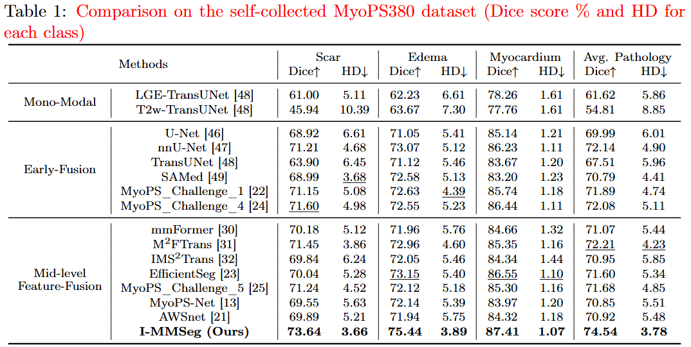

<h1 align="center">I-MMSeg: Intensity-guided Multimodal Image Segmentation</h1>

## 📰 News
- [12/01/2025] The code for reproducing our multimodal myocardial pathology segmentation results on the MyoPS++ and MyoPS380 datasets is now available. This release is intended for peer review and reproducibility verification. 

## 📑 Overview
I-MMSeg is an intensity-guided multimodal CMR segmentation framework for myocardial pathology segmentation. The method introduces modality-specific intensity priors generated by multimodal large language models (e.g., GPT-4o), and encodes them using a CLIP-based prior encoder. Two tailored modules—an intensity-prior-guided cross-modal feature enhancement module and a class feature modulation module—integrate these priors into the segmentation pipeline, improving cross-modal feature discrimination and boosting overall segmentation accuracy.


## ⚙️ Quick Start

### 1. Data Preparation

Please download the following packages, 👉 Download link: [Google Drive](https://drive.google.com/drive/folders/1s8MCmZDA5kslwicDBFamX3hXiY72EkzX?usp=drive_link)

- **Conda environment (I_MMSeg_env.tar.gz)**
- **ViT pre-trained weights (R50-ViT-B_16.npz)**
- **I-MMSeg model weights (epoch_299.pth)**
- **MyoPS380 dataset (raw + processed; available upon approval)**
For detailed information and usage permissions regarding the MyoPS380 dataset, please refer to **Dataset Description** (<a href="./docs/MyoPS380 dataset description.md">click here</a> for details).

First, clone this repository to your local machine and install the required dependencies (`torch`, `torchvision`, `numpy`, and `open_clip`):

```bash
git clone git@github.com:zzzzzzl24/I_MMSeg.git 
cd I_MMSeg
pip install -r requirements.txt
```

Alternatively, we provide a pre-packaged Conda environment created with conda-pack.
You can restore it using the standard conda-pack unpacking procedure:

```bash
mkdir -p ./miniconda3/envs/I_MMSeg
tar -xzf I_MMSeg_env.tar.gz -C ./miniconda3/envs/I_MMSeg
cd ./miniconda3/envs/I_MMSeg
./bin/conda-unpack
source ./bin/activate
```

### 2. Model Training & Inference

The project uses the following directory structure:
```bash
I_MMSeg/
├── model/
│   └── vit_checkpoint/
│        └── imagenet21k/              
│             # place R50-ViT-B_16.npz here
│
├── weights/
│   └── TU_Myops128/
│        └── TU_pretrain_R50-ViT-B_16_skip3_epo300_bs24_lr0.001_128/
│             # place epoch_299.pth here
│
├── MyoPS380_dataset/     # place MyoPS380 dataset here
│   ├── Raw_data/         # raw bssfp, t2w, lge, label                    
│   └── Processed_data/   # preprocessed data for training/testing
├── preprocess_data.py    # preprocessing script
├── train.py              # training script
├── test.py               # inference script
├── requirements.txt      # Reproducible environment definition
└── README.md
```

Now, try the model with just a few lines of code:

- Run the train script on MyoPS380 dataset. The batch size can be reduced to 12 or 6 to save memory (please also decrease the base_lr linearly), and both can reach similar performance.

```bash
CUDA_VISIBLE_DEVICES= "0,1" python train.py --dataset Myops --vit_name R50-ViT-B_16
```

- Run the test script on MyoPS380 dataset. The testing results reported in the manuscript can be reproduced.

```bash
python test.py --dataset Myops --vit_name R50-ViT-B_16
```

Comparative experiments on the MyoPS380 dataset




## Reference
* [Google ViT](https://github.com/google-research/vision_transformer)
* [ViT-pytorch](https://github.com/jeonsworld/ViT-pytorch)
* [TransUNet](https://github.com/Beckschen/TransUNet/tree/main)
* [Voxelmorph](https://github.com/voxelmorph/voxelmorph/tree/dev?tab=readme-ov-file)

<!-- ## Citations

```bibtex
@article{

}
``` -->
