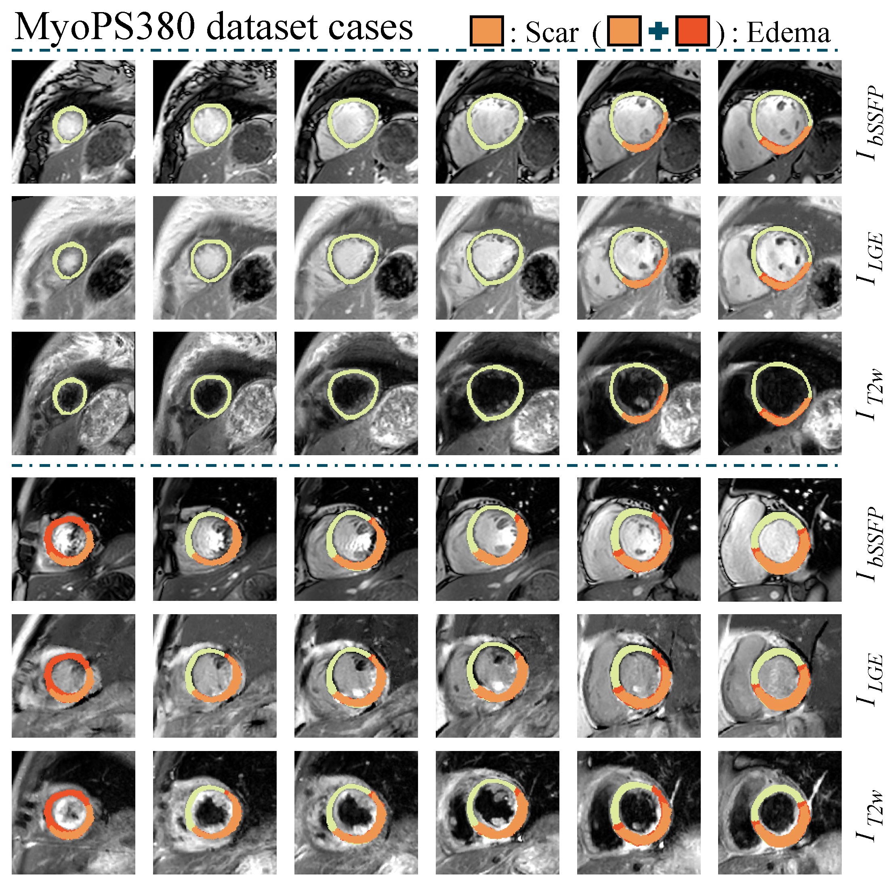

## Dataset Description - MyoPS380 dataset

**(1) Background**

Assessing myocardial viability is critical for the diagnosis and management of patients with myocardial infarction (MI). Cardiac magnetic resonance (CMR) plays a central role in this process, offering detailed structural, functional, and tissue-characterization information. Three commonly used CMR modalities provide complementary perspectives:

- **bSSFP (balanced Steady-State Free Precession)** — captures cardiac motion and provides clear anatomical boundaries.  
- **LGE (Late Gadolinium Enhancement)** — visualizes myocardial infarction and fibrotic tissue.  
- **T2-weighted (T2w)** — highlights acute injury and myocardial edema.

Together, these modalities enable comprehensive evaluation of myocardial tissue, facilitating differentiation between normal myocardium, scar (infarction), and edema. However, manual annotation is labor-intensive, time-consuming, and subject to inter-/intra-observer variability, motivating the need for automated multi-modality myocardial pathology segmentation.

To support research in this direction, the **MyoPS380 dataset** provides multi-modality CMR data from **380 patients**, including bSSFP, LGE, and T2W modalities along with pixel-wise myocardial pathology annotations. The dataset serves as a high-quality benchmark for developing advanced algorithms that exploit multi-modality complementary information for reliable myocardial pathology classification and segmentation, ultimately supporting clinically applicable AI solutions.

---

**(2) Data Source and Quality Control**

Prior to inclusion in the MyoPS380 dataset, all candidate cases underwent systematic image quality screening to ensure data reliability and usability. The screening process involved: excluding cases with significant motion artefacts, cardiac motion artefacts, or structural distortion due to respiratory inconsistency; and excluding cases with missing key modalities (e.g., incomplete LGE acquisition) or inadequate ventricular coverage. After screening, **380 multi-modality CMR studies** acquired at **Renji Hospital, Shanghai Jiao Tong University School of Medicine (2017–2023)** were retained. These encompassed three modalities—bSSFP, LGE, and T2W—providing a comprehensive and high-quality imaging foundation for cardiomyopathy analysis.

---

**(3) Dataset Structure**

The dataset follows a unified naming and directory convention to facilitate model training, reproducibility, and further extension. Each patient's multi-modality images are stored separately by modality, with labels matched by patient ID.

```bash
MyoPS380_dataset/
├── Raw_data/
│   ├── bSSFP/
│   │     ├── case0001.nii.gz
│   │     ├── ...
│   │     └── case0380.nii.gz
│   ├── LGE/
│   ├── T2w/
│   └── label/
│         ├── case0001_gt.nii.gz
│         ├── ...
│         └── case0380_gt.nii.gz
```

- `caseXXXX.nii.gz`: the 3D CMR volume of a single modality.  
- `caseXXXX_gt.nii.gz`: merged myocardial pathology labels (normal myocardium, scar, edema).  

Annotations were performed by **three experienced radiologists** on modality-specific images and validated by a senior radiologist. All images and labels are stored in **NIfTI** format for convenient cross-platform use and deep learning integration.

---

**(4) Preprocessing Pipeline**

To address inherent differences across multi-modality CMR (bSSFP, LGE, T2W)—including slice count, imaging geometry, and voxel resolution—we designed a structured preprocessing pipeline to ensure spatial consistency and improve model training stability. The detailed processing flowchart and particulars are as follows:


***1.Slice-Level Correspondence Construction***

Slice numbers differ across modalities, hindering accurate fusion. For each case:

- DICOM `ImagePositionPatient` was used to compute the 3D spatial coordinates of slices.
- The modality with the fewest slices was chosen as the reference.
- A nearest-neighbor matching strategy (Euclidean distance) established one-to-one slice correspondence.
- Unmatchable slices were automatically discarded.

This process ensures consistent slice counts and better multi-modal compatibility.


***2.Spatial Normalization: Resampling and Center Cropping***

To mitigate scale inconsistencies:

- bSSFP (1.172×1.172 mm), LGE (0.8929×0.8929 mm), and T2W (0.8929×0.8929 mm) images were **resampled to 1×1 mm** in-plane resolution.
- Central cropping to **224×224** ensured uniform input size and focus on the cardiac region.
- Pixel intensities were **linearly normalized to [0, 255]** to harmonize modality intensity ranges.


***3.Slice-wise 2D Affine Registration Guided by Myocardial Masks***

Due to inter-modality differences influenced by respiration, cardiac motion, and acquisition parameters, significant spatial misalignment exists.

- A 2D affine transformation (rotation, scaling, shearing, translation) was estimated slice-by-slice.
- Myocardial segmentation masks served as structural priors for registration.
- The estimated transform was applied to both images and labels for high-accuracy alignment within the myocardial region.


***4.Voxelmorph-Based Non-Rigid Deep Registration***

Affine alignment captures only linear transformations. To correct non-linear deformations across modalities:

- A 2D Voxelmorph model was applied to each slice.
- The model learns pixel-level deformation fields between fixed and moving modalities.
- Deformation fields were propagated to all modalities and labels.

This step substantially enhances geometric consistency in the myocardial region.


***5.Final ROI Cropping and Data Packaging***

- Myocardial masks were used to perform ROI cropping, reducing background redundancy.
- Final images were standardized to **128×128**.
- Aligned modality slices were stacked into 3D volumes (NIfTI) for training and evaluation.

This pipeline yields spatially coherent, scale-normalized, and structurally standardized multi-modality CMR data.

---

**(5) Representative Examples**

The dataset covers a broad spectrum of myocardial pathology, ranging from mild infarction to extensive transmural MI accompanied by widespread edema.

Below are two groups of representative multi-modality slices with annotations:



These examples highlight:1. modality-specific contrast characteristics. 2. inter-subject structural variability. 3. high consistency among expert annotations.
The visual diversity underscores the necessity of multi-modality fusion and supports the development of robust segmentation algorithms.

---

**(6) Ethical Approval**

The MyoPS380 dataset was approved by the Ethics Committee of Renji Hospital, Shanghai Jiao Tong University School of Medicine **(Approval No. [2018]093)**  
and fully anonymized before data release to ensure patient privacy and compliance with ethical standards.

---

**(7) Data Usage Guidelines**

The **MyoPS380 dataset** is currently undergoing peer review as part of an accompanying publication.  
Pending successful completion of the final compliance check, it is expected to be publicly released **before January 2026**.

You can download the dataset release agreement from 👉 [here](./MyoPS380_Dataset_Release_Agreement.docx).

Please ensure that a permanent or long-term responsible person (e.g., professor) completes the form with a **handwritten signature**.  
After signing, send the scanned electronic version to:**donggenf@whu.edu.cn**, **Subject:** *MyoPS380 Dataset Release Agreement*.
Please send the email from an **institutional email address** (e.g., xxx@xxx.edu.xx). Requests sent from free email providers (Outlook, QQ, Hotmail, etc.) will be politely declined.

After verifying your information, we will send you the dataset download link. We usually reply within a week. If you do not receive a response—possibly due to delivery issues—please modify the email content or title and try resending.
